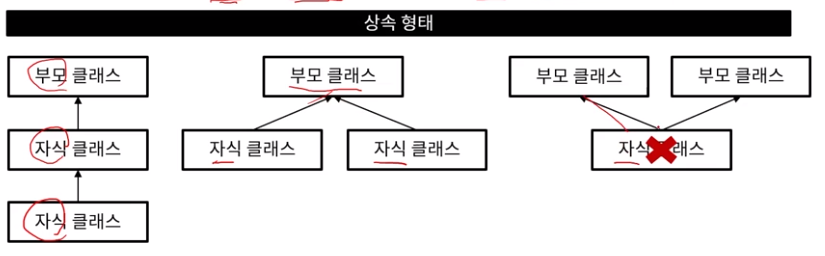

## 자바 프로그램 작성/ 실행 과정

자바 소스코드  -> 자바 컴파일러 -> 바이트 코드 -> 윈도우 jvm -> 윈도우에서 실행
                                            -> 리눅스 jvm -> 리눅스에서 실행

## 변수 선언
```java
int age = 20;
String name = "soony";
```

## 변수 표기법
1. 카멜
> myName  => 변수명이나 함수명에 쓰임.
2. 파스칼 
> MyName  => 주로 클래스 이름에 쓰임
3. 스네이크
> 사용하지 않음.

## 변수 타입
1. float
> float floatNum = 1.23f;  뒤에 f를 붙어줘야 float로 인식함. 붙여주지 않으면 dobule로 인식함.

2. char -> int
> (int)charvalue

## 문자열
> 선언 String test = "hi";

## 문자열 메소드
> equals, indexOf, relplace, substring, toUpperCase 

- substring(0,3) => 0 부터 2까지임. 

```java
s1.equals(s2) ==> 값이 같을 때에는 true
s1 == s2 ==> 주소값을 보기 때문에 새로 할당 받은 객체일 경우에는 false
```
<br>

## StringBuffer
> 문자열을 자주 추가하거나 변경할 때 사용하는 자료형
```java
StringBuffer sb1 = new StringBuffer("helloWorld");
sb1.apepnd("123123")

값이 빈번하게 변경할 경우에는 String Buffer을 사용하자. 메모리를 아낄 수 있음.
```
## StringBuffer method
> append, insert, substring
<br>

## 배열

> int[] myarray = {1,2,3,4};
<br>   

## 리스트 

1. 배열과 같이 여러 데이터를 담을 수 있는 자료형
2. 추가로 여러가지 메소드를 제공
```java
ArrayList l1 = new ArrayList();
l1.add(1)
```
## 리스트 메소드
> add, get, size, remove, clear, sort, contains
```java
l2.sort(Comparator.naturalOrder());
l2.sort(Comparator.reverseOrder());
```
<br>

## 맵(map)
```java
HashMap<String,String>map = new HashMap<String,String>();
map.put("product","kiwi");
map.put("price","9000");
```
<br>

## 맵 메소드
> put, get, size, remove, containsKey

## 제네릭스
> 자료형을 명시적으로 지정
> 제한적일 수 있지만 안정성을 높여주고 형변환을 줄여줌

```java
ArrayList<String> l1 = new ArrayList<String>();
HashMap<String,String> map1 = new HashMap<String,String>();
```

## 행과 연산자
> num ++    

## 삼항연산자
```java
int a = 100;
String aRes = (a == 100 ? "yes":"no";
```

## switch 문 
> golang과 달리 break를 써줘야함.

## while문
```java
while(조건문){
    반복하여 실행할 내용;
}

do{
    반복하여 실행할 내용;
}while(조건문);

do-while을 쓰는 이유는 한번은 실행함. 
```

## for each 문
```java
    int [] nums = {1,2,3,4,};
    for (int num : nums){
        System.out.println(num);
    }
```

## 다차원 배열
> int[][] myarr = {{1,2,3},{1,2,3}};
> int[][] myarr = new int[3][2];

## 클래스
> 클래스는 객체변수, 메소드로 이루어져 있다.
```java
public class 클래스명{
    // 객체변수
    // 메서드
    // + 접근 제어자
    // + static
}
클래스명 객체명 = new 클래스명();
```

## 생성자
> 객체가 생성될 때 자동으로 호출됨, 리턴 타입 없음, 클래스명과 이름 맞추기

```java
public class 클래스명{
    클래스명(){}
}
```

## this, this()
this
-> 객체 자신을 의미
this()
-> 생성자를 의미 

```java

class Car {
    String name;
    String age;
    Car(String name, String age){
        this.name = name;
        this.age = age;
    }
}

public class Main {
    public static void main(String[] args){
    Car c = new Car("soony","19");
        System.out.println(c.name + c.age);
    }
}

output = soony19
```

## 오버로딩
> 한 클래스 내에서 같은 이름의 메소드를 여러 개 정의
> 오버로딩 조건
    - 메소드의 이름이 같아야함
    - 매개변수의 개수 또는 타입이 달라야함.

## 접근제어자
1. private: 해당 클래스내에서만 접근 가능
2. public: 어디서나 가능
3. defualt: 해당 패키지 내에서만 접근 가능
4. protected: 해당 패키지 및 상속받은 클래스에서 접근 가능

## static (메소드 영역, 스태택 영역에 저장 되어 가장 먼저 메모리에 올라가게 된다.)
> 변수나 메소드의 특성을 바꾸는 키워드 
> static 특징
    - 메모리에 한번만 할당됨
    - 즉, static 변수나 메소드는 공유되는 특성을 가짐.
> static 클래스 변수
    - 해당 클래스의 각 객체들이 값을 공유
> static 클래스 매소드
    - 객체를 생성하지 않아도 호출 가능

## 상속
> 기존 클래스에 기능 추가 및 재정의하여 새로운 클래스를 정의
    - 부모 클래스: 상속 대상이 되는 기존 클래스 = 상위 클래스, 기초 클래스
    - 자식 클래스: 기존 클래스를 상송하는 클래스 = 하위 클래스, 파생 클래스
> 부모 클래스의 필드와 메소드가 상속됨 (단, 생성자, 초기화 블록은 상속되지 않음)

> 다중 상속은 불가능
> private,default 맴버는 자식 클래스에서 접근 불가 

```java
class 자식 클래스명 extends 부모 클래스명{
    필드;
    메소드;
    ...
}
```

## super,super()
> super
    - 부모 클래스와 자식 클래스의 멤버 이름이 같을 때 구분하는 키워드
> super() 
    - 부모 클래스의 생성자 호출 

## 다형성
> 하나 객체가 여러 가지 타입을 가질 수 있는 것
```java
class Person{}
class Student extends Person{}

// 업캐스팅
Person p1 = new Student(); 부모 = 자식 은 가능함. 반대는 불가능함.
```

## instanceof
> 실제 참조하고 있는 인스턴스의 타입 확인

Q) 업케스팅, 다운케스팅은 언제하는 가?

```java
import java.util.Scanner;

class Car {
    Car(){}
    public void horn(){
        System.out.println("빵빵");
    }
}
class FireTruck extends Car{
    public void horn(){
        System.out.println("위이잉");
    }
}

class Ambulance extends Car{
    public void horn(){
        System.out.println("삐뽀삐뽀");
    }
}

public class Main {
    public static void main(String[] args) {
        Car c = new Car();
        c.horn();

        c = new FireTruck();
        c.horn();

        c= new Ambulance();
        c.horn();

        Car[] c1 = {new Car(), new FireTruck(), new Ambulance()};
        for (Car item: c1){
            item.horn();
        }
    }
}
```

## 추상 메소드
> 자식 클래스에서 반드시 오버라이딩 해야하는 메소드
> 선언만하고 구현 내용 없음.

## 추상 클래스
> 하나 이상의 추상 메소드를 포함하는 클래스 
> 반드시 구현해야 하는 부분에 대해 명시적으로 표현
> 추상 클래스 자체는 객체 생성 불가 

## 인터페이스
> 다중 상속처럼 사용할 수 있는 기능
> 추상 메소드와 상수만으로 이루어짐

## 내부클래스(중첩 클래스)
> 내부 클래스 특징 

    - 내부 클래스에서 외부 클래스 멤버에 접근 가능
    - 외부에서는 내부 클래스에 접근 불가능 

> 내부 클래스 종류

    - 인스턴스 클래스
    - 정적 클래스
    - 지역 클래스
    - 익명 클래스 

## 예외 처리
```java
try{

}catch(에러클래스 e){
    
}catch(예외 case 2){

}finally {
    항상 실행되는 부분; 
}
```
> throw: 예외를 발생시킴
> thorws: 예외를 전가시킴 

```JAVA
// Java 프로그래밍 - 예외 처리

import java.io.BufferedReader;
import java.io.FileReader;
import java.io.IOException;

class NotTenException extends RuntimeException {}

public class Main {

    public static boolean checkTen(int ten) {
        if (ten != 10) {
            return false;
        }

        return true;
    }

    public static boolean checkTenWithException(int ten) {
        try {
            if (ten != 10) {
                throw new NotTenException();
            }
        } catch (NotTenException e) {
            System.out.println("e = " + e);
            return false;
        }

        return true;
    }

    public static boolean checkTenWithThrows(int ten) throws NotTenException {
        if (ten != 10) {
            throw new NotTenException();
        }

        return true;
    }

    public static void main(String[] args) throws IOException {
        System.out.println("== 0으로 나누기 ==");
        int a = 0;
        try {
            a = 5 / 0;
        } catch (ArithmeticException e) {
            System.out.println("0으로 나누기 예외 발생");
            System.out.println("e = " + e);
        } finally {
            System.out.println("1-1 연습 종료");
        }

//      1-2. 배열 인덱스 초과
        System.out.println("== 배열 인덱스 초과 ==");
        int[] b = new int[4];
//        b[4] = 1;

        try {
            b[4] = 1;
        } catch (ArrayIndexOutOfBoundsException e) {
            System.out.println("인덱스 초과!");
            System.out.println("e = " + e);
        }
        
//      1-3. 없는 파일 열기
        System.out.println("== 없는 파일 열기 ==");
//        BufferedReader br = new BufferedReader(new FileReader("abc.txt"));


//      2. throw, throws
        System.out.println("== checkTen ==");
        boolean checkResult = Main.checkTen(10);
        System.out.println("checkResult = " + checkResult);

        System.out.println("== checkTenWithException ==");
        checkResult = checkTenWithException(5);
        System.out.println("checkResult = " + checkResult);

        System.out.println("== checkTenWithThrows ==");
        try {
            checkResult = checkTenWithThrows(5);
        } catch (NotTenException e) {
            System.out.println("e = " + e);
        }
        System.out.println("checkResult = " + checkResult);

    }

}

```

## 컬렉션 프레임워크
> 여러 데이터를 편리하게 관리할 수 있게 만들어 놓은 것
    
    - 자료 구조 및 알고리즘을 구조화

> 대표 인터페이스
 
    - LIST, SET, MAP

## SET
```java
HashSet set1 = new HashSet();
set1.add(1);
set1.size();
set1.contains(1);

TreeSet set2 = new TreeSet();
set2.add(2);
set2.size();
set2.first();
set2.last();
set2.lower(10); 
set2.higher(10); 
```

## hashMap
```java
HashMap map = new HashMap();
map.put("fdksjfs");

TreeMap map2 = new TreeMap();
map.put("fkdsjlfs"); 
```

## 람다식
> 익명함수
```JAVA
    반환타입 메소드이름 (매개변수, ..){
        실행문
    }

    public int sum (int x, int y){
        return x+y;
    }

    
    (int x, int y) -> {return x+y;};  
```

## 스트림
. 배열, 컬렉션 등의 데이터를 하나씩 참조하여 처리 가능한 기능

> for문의 사용을 줄여 코드를 간결하게 함

> 스트림은 크게 3가지로 구성

    - stream 생성
    - 중개 연산
    - 최종 연산

> 스트림 생성    

```java
    배열 스트림
    String[] arr = new String[]{"a","b","c"};
    Stream stream =Array.stream(arr);

    컬렉션 스트림
    ArrayList list = new ArrayList(Arrats.asList(1,2,3));
    Stream stream = list.stream();
```
> 스트림 중개연산 

```java
    Filtering 
    IntStream intStream = IntStream.range(1,10).filter(n -> n % 2 == 0);
    
    Mapping
    IntStream intStream = Intstream.range(1,10).map(n -> n+1);
```

> 스트림 최종연산

```java
    Sum,Average
    IntStream.range(1,5).sum()
    IntStream.range(1,5).average().getAsDouble();

    min,max
    IntStream.range(1,5).min().getAsInt();
    IntStream.range(1,5).max().getAsInt();
```

> 스트림은 최종연산을 만나며 끝난다.
