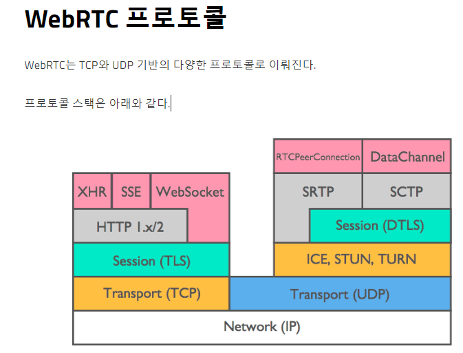
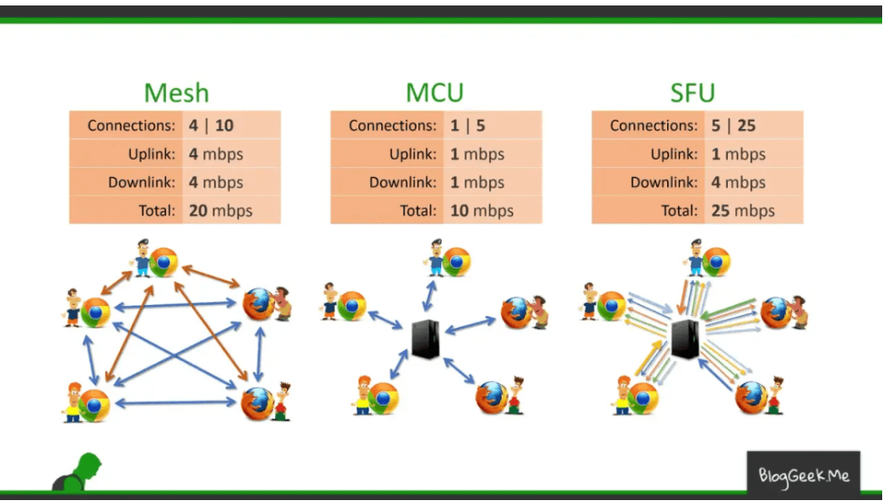
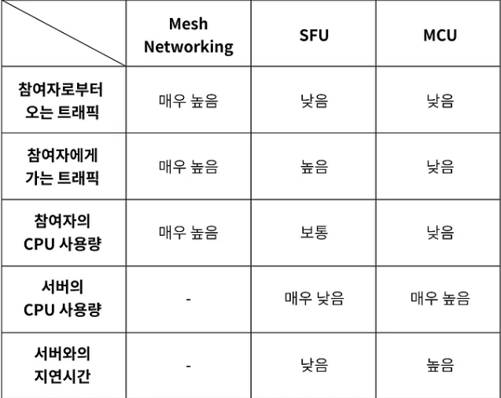

## webrtc
> webrtc란 웹 브라우저 환경 및 모바일에서도 사용 가능한 비디오, 음성 및 일반 데이터가 실시간으로 p2p 통신을 할 수 있게 지원하는 오픈소스이다.

> UDP 기반의 스트리밍 기술. 

## ICE 
> 브라우저가 peer를 통한 연결이 가능하도록 해주는 프레임워크이다.
STUN OR TURN 서버를 이용한다.

## STUN
> 클라이언트 자신의 PUBLIC ADDRESS (IP:PORT)를 알려준다.
클라이언트의 NAT의 종류에 따라 STUN을 사용할지 TURN을 사용할지 결정한다. 
만약에 "SYMEMETRIC NAT"를 사용한다면 TURN 서버를 사용해야한다.

## TURN 
> 일종의 우회서버라고 보면 된다. 이로 인해서 생기는 오버헤드가 발생한다.

## SDP (SESSION DESCRIPTION PROTOCOL)
> 해상도나 형식, 코덱, 암호화등의 멀티미디어 컨텐츠의 연결을 설명하기 위한 표준이다.
> 기술적으로 보자면 프로토콜은 아니다. 데이터의 포멧은 디바이스간의 미디어를 공유하기 위한 연결을 설명하기 위해 사용한다.

## WEBRTC 토폴로지(연결 유형)
1. MESH
2. MCU
3. SFU

- MESH   
-> 1:1 연결에 적합.

- SFU   
-> 종단 간 미디어 트래픽을 중계하는 중앙 서버 방식이다.   
-> 클라이언트는 연결된 모든 사용자에게 데이터를 보낼 필요없이 서버에게만 자신의 영상 데이터를 보내면 된다. 

- MCU   
-> 다수의 송출 미디어를 중앙 서버에서 혼합 또는 가공하여 수신측으로 전달하는 중앙 서버 방식이다. 따라서 중앙 서버의 높은 컴퓨팅 파워가 요구된다.   
-> WebRTC의 최대 장점인 실시간성이 저해된다.     

## transcoding?

- 트랜스코딩?

> 이미 압축된 파일을 다른 포멧,코덱,비트레이트,해상도로 변환 하는 프로세스를 말합니다.

- 트랜스코딩이 필요한 이유

> 적응 비트 전송률 비디오 품질을 저하시키지 않으면서 많은 최종 사용자에게 접근할 수 있는 가장 효과적인 방법입니다.

- 트랜스 코딩 과정 

1. 원본파일 디코딩을 통해 무압축 형식으로 변환 
2. 타겟 형식으로 변환

## 인코딩 VS 트랜스코딩 VS 트랜스 먹싱

### 인코딩
> 원시데이터를 특정 포멧이나 코덱으로 압축 및 변환하는 과정입니다. 

### 트랜스코딩
> 이미 인코딩된 데이터를 다른 포멧이나 코덱으로 변환하는 과정입니다. 

### 트랜스먹싱
> 코덱은 변경하지 않고 컨테이너만 변환하는 과정입니다. 

## 비트레이트

> 인터넷을 통해 정보가 전송되는 속도입니다. 일반적으로 비트레이트가 높을 수록 높은 해상도의 비디오 품질입니다. 하지만, 대역폭에 비해 비트레이트가 높을 경우 버퍼링등의 문제가 발생할 수 있습니다. 

- 적응형 비트 전송률 (ABR)
> 최종 사용자가 특정 스트리밍 기능에 따라 가능한 최고 품질로 비디오를 스트리밍할 수 있는 방법입니다. 

- 다중 비트 전송률 스트리밍 (MBR) Multiple Bitrate Streaming
> 처음에 여러 다른 비트 전송률로 트랜스 코딩된다는 점에서 ABR과 유사한 또 다른 일반적인 형식입니다. 다만, MBR은 ABR과 달리 사용자의 상태를 자동으로 감지하지 않으며 가능한 가장 높은 비트 전송률을 사용하려고 합니다. 

## simulcast vs MBR

> simulcast는 동일한 컨텐츠를 동시에 여러 가지 형식이나 품질로 방송하는 것을 말합니다. 
주로, "실시간 통신" 과 "라이브 스트리밍" 과 같은 환경에서 사용합니다.

- 작동원리:
    => 동일한 비디오 컨텐츠를 여러개의 비트레이트로 인코딩하고 스트리밍합니다.

> MBR는 하나의 소스에서 여러 비트레이트로 인코딩된 여러 스트림을 생성하는 것을 말합니다. 
이는 주로 "VOD( video on demand)" 나 "라이브 스트리밍" 같은 환경에서 사용됩니다.

- 작동원리:
    => 사용자는 자신의 네트워크 속도에 따라 최적의 비디오 품질을 경험할 수 있습니다. 

## 실시간 통신 vs 라이브 스트리밍

> 실시간 통신은 "양방향 통신", "지연 시간의 최소화"

> 라이브 스트리밍은 "단방향 통신", "다소의 지연 시간 허용", "대규모 시청자 대상"

출처: 
- https://millo-l.github.io/WebRTC-%EC%9D%B4%EB%A1%A0-%EC%A0%95%EB%A6%AC%ED%95%98%EA%B8%B0/
- https://doublem.org/webrtc-story-01/
